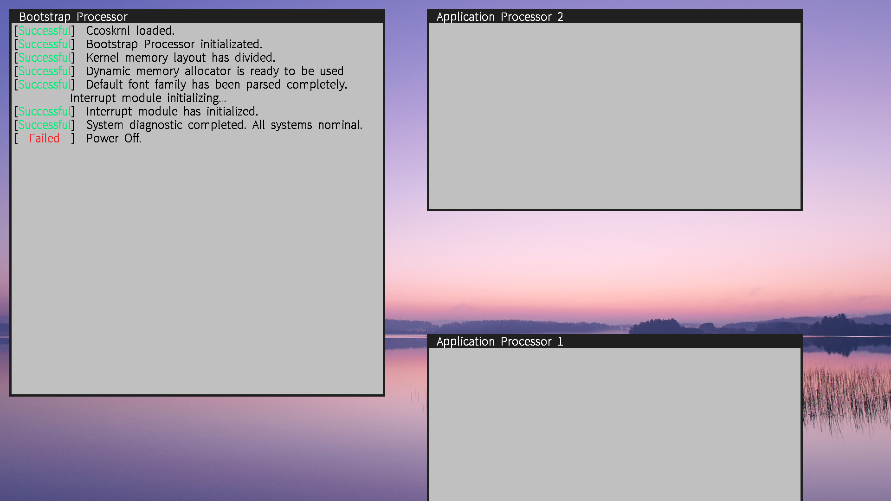

# ccoskrnl

ccos is a hobby 64-bit operating system. I'm writing it on x86_64, because I like sadness and misery. I do not possess extensive expertise, and I am not a expert in OS designing so it may contains numerous bugs. Actually, many of the design concepts I have implemented are inspired by Windows NT such as ccldr(OS Loader for ccos) and dynamic memory manager and so on. WRK(Windows Research Kernel) is an extremely excellent project suitable for those who wish to delve deeper in OS designing. 

## Features

**UEFI**

ccos bases UEFI to bootstrap ccoskrnl. UEFI greatly facilitates OS Loader developing. Developer can directly call the interfaces provided by UEFI. There is one thing to note here, that ccos needs ccldr to load ccoskrnl. It is a bit like "a second stage boot loader". But in fact, BOOTX64.efi merely searches for a suitable size of physical memory and loads ccoskrnl image into the space. The ccldr need to map kernel space into high address of virtual address space and to set GDT(Global Descriptor Table, a significant structure for x86_64 architecture.)

**Multi Processors(Developing)**

Multi processors support is an enormous challenge for me. I do not guarantee a good implementation of multi-processors system.

**APIC**

APIC(Advanced Programmable Interrupt Controller) is a critical component in modern computer system. It provides the possibility for multi-processors system and supports multilevel interrupt priority on the hardware level. Unfortunately, APIC is complicated. Since to fully understand APIC needs sound knowledge of computer system, I only implement the basic driver of APIC.

**TrueType**

Yes, ccos displays characters on screen through rendering TrueType Fonts(Default font in ccos is Adobe Source Han Sans SC VF.). It's not worth to output characters using TrueType rendering. For early OS developing, using bitmap fonts is more recommended method of characters output. 

Probably the greatest thing about storing characters as outlines is that only one outline per character is needed to produce all the sizes of that character OS will ever need. A single outline can be scaled to an enormous range of different sizes, some of which are illustrated below. This enables the same character to be displayed on monitors of different resolutions, and to be printed out at a large number of different sizes. To scale a character outline is a simple mathematical operation, as indeed are other transformations such as rotation and reflections.

The structure of TrueType is complex, I just write a font rasterizer and not fill. Actually, I have not achieved font rasterizer, because I didn't implement hinting of TrueType. Hinting is at the heart of TrueType. Its inventors, mindful of the diversity of opinion on the "correct" way to hint type, decided there was no single hinting paradigm that they would impose upon type developers. Instead, they linked a relatively simple rasterizer to a new interpreted programming language. For font readability, however, this is enough.

**Wide Char**

ccos offers two character type, "char" and "wch_t"(wide char, 4-bytes), for storing all characters. Regardless of the character type, ccos always converts wch_t first, then outputs a wide string. In fact, TrueType parser in ccos only uses "Unicode 2.0 and onwards semantics", which platform ID = 0 and Encoding ID = 3 in cmap(cmap — Character to Glyph Index Mapping Table, a struture in TrueType.). Therefore, it exclusively supports Unicode Basic Multilingual Plane characters (U+0000 to U+FFFF).

**Memory Manager**

The designing ideas of memory management is inspired by Window NT, which contains PFN database, Lookside, Page-Directory self mapping scheme, lamination memory pool management and so on, but not all.

**Graphics Output with multi-windows**

ccos supports multi-windows, which means it can output text in different window on screen. It's uesful to debug multi-processors through open a text-output window to each processor. Even if not have mouse driver, user also can use keyboard to select which window need to enter characters.

## TO-DO

- [ ] Keyboard Driver
- [ ] Activate application processors.
- [ ] Dynamic memory manager with memory leaks detection.

## Installation

For installation, please refer to the [ccoskrnl build](https://github.com/ccoskrnl/ccoskrnl/wiki/Installation)

## Contributing

The math library(reflibs/libm.a) was provided by @Estrella

## License

No license.

## Contact

ChengCheng - [@github](https://github.com/ccoskrnl) - 2010705797@qq.com
ccoskrnl: https://github.com/ccoskrnl/ccoskrnl

## Acknowledgments

- [**Intel® 64 and IA-32 architectures software developer's manuals**](https://www.intel.com/content/www/us/en/developer/articles/technical/intel-sdm.html)

- [**AMD64 Architecture Programmer’s Manual Volume 2: System Programming**](https://www.amd.com/content/dam/amd/en/documents/processor-tech-docs/programmer-references/24593.pdf)

- [**Windows内核设计与实现**](https://book.douban.com/subject/4719159/)

- [**Computer Systems: A Programmer’s Perspective 3rd**](https://www.pearson.com/en-us/subject-catalog/p/computer-systems-a-programmers-perspective/P200000003479/9780138105396)

- [**The C Programming Language**](https://en.wikipedia.org/wiki/The_C_Programming_Language)

- [**OSDev Wiki**](https://wiki.osdev.org/)

- [**ACPI Specification**](https://uefi.org/htmlspecs/ACPI_Spec_6_4_html/Frontmatter/Overview/Overview.html)

- [**UEFI Specification**](https://uefi.org/specs/UEFI/2.10/01_Introduction.html)

- ...