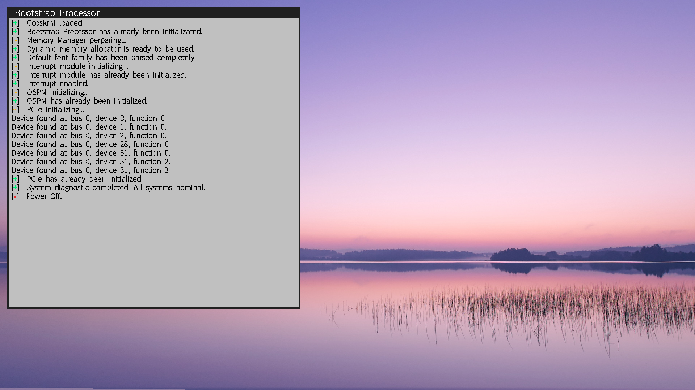

# ChengCheng OS

ChengCheng OS (CCOS) is a hobby 64 bit operating system. I'm writing it on x86, because I like sadness and misery. This project was still in developing. I'm a beginner for operating system design. Many of the design concepts I have implemented are inspired by Windows NT such as ccldr (OS Loader for ChengCheng OS) and Memory manager. And, there is plenty more courses that I need to learn in the comming months. So, I will not update the project frequently.

## Demo

## Features

- **UEFI**

    CCOS uses UEFI to bootstrap ccoskrnl. UEFI greatly facilitates OS Loader developing. Developer can directly call the interfaces provided by UEFI (Use C language instead of assembly). There is one thing to note here, that CCOS still needs ccldr (another binary executable file) to load ccoskrnl. It is a bit like "a second stage boot loader". But in fact, BOOTX64.efi just simply divides kernel space and searches for a suitable physical memory space for ccoskrnl image loading. Then ccldr will map kernel space into high address of virtual address space and set GDT(Global Descriptor Table, a significant structure for x86 architecture.)

- **Multi-Cores**

    Multi-cores support is an enormous challenge for me. I do not guarantee a good implementation of multi-cores system. For now, CCOS can correctly active other application cores. Not like other operating system demo, CCOS puts application cores initialization routine at a isolated binary file and load it into the first 1 MiB of physical memory and construct separately the page table for the memory space. Before of application cores running, CCOS will fix the citation of relative address of the binary program. I have to admit, this is a foolish design.

- **APIC**

    APIC(Advanced Programmable Interrupt Controller) is a critical component in modern computer system. It provides the possibility for multi-cores system and supports multilevel interrupt priority on the hardware level. Unfortunately, APIC is complicated. Since to fully understand APIC needs sound knowledge of computer system, I only implement the basic driver of APIC.

- **TrueType**

    CCOS displays characters on screen through rendering TrueType Fonts(Default font in CCOS is **Adobe Source Han Sans SC VF**). It's not worth to output characters using TrueType rendering. For early OS developing, using bitmap font is more recommended method of characters output.

    Probably the greatest thing about storing characters as outlines is that only one outline per character is needed to produce all the sizes of that character OS will ever need. A single outline can be scaled to an enormous range of different sizes, some of which are illustrated below. This enables the same character to be displayed on monitors of different resolutions, and to be printed out at a large number of different sizes. To scale a character outline is a simple mathematical operation, as indeed are other transformations such as rotation and reflections.

    The structure of TrueType is complex, I only implemented the font rasterizer without hinting of TrueType. Hinting is at the heart of TrueType. Its inventors, mindful of the diversity of opinion on the "correct" way to hint type, decided there was no single hinting paradigm that they would impose upon type developers. Instead, they linked a relatively simple rasterizer to a new interpreted programming language. For font readability, however, this is enough.

    These is a cirtical issus here, which is that the preformence of text output of CCOS is very pool. The badly performing will seriously slow down the running of ccos. I don't know how to optimize the function because the font drawing is a relatively complex process. Another method is use bitmap font to instead the TrueType font.

- **Wide Char**

    CCOS offers two character type, "char" and "wch_t"(wide char, 4-bytes), for storing all characters. Regardless of the character type, CCOS always converts wch_t first, then outputs a wide string. In fact, TrueType parser in CCOS only uses "Unicode 2.0 and onwards semantics", which platform ID = 0 and Encoding ID = 3 in cmap(cmap — Character to Glyph Index Mapping Table, a struture in TrueType.). Therefore, it exclusively supports Unicode Basic Multilingual Plane characters (U+0000 to U+FFFF).

- **Memory Manager**

    The design ideas of memory management is inspired by Window NT, which contains PFN database, Lookside, Page-Directory self mapping scheme, lamination memory pool management and so on, but not all.

- **Graphics Output with multi-windows**

    CCOS supports multi-windows, which means it can output text in different window on screen. It's uesful to debug multi-cores through open a text-output window to each core. Even if not have mouse driver, user also can use keyboard to select which window need to enter characters.

## TO-DO

- [ ] Bug fix: Add spinlock to prevent conflicts of multiple windows output

- [x] Dynamic memory manager with memory leaks detection
- [x] System PTE management

- [ ] PCIe management
- [ ] NVMe Driver
- [ ] Keyboard Driver (Not urgent)

- [ ] Use bitmap fonts rather than TypeTrue Fonts rendering.
- [ ] Power Management.
- [ ] CPU prefromence management.

## Requirements

- **QEMU with 2 GiB RAM or higher**

    I just roughly divide the memory space such that the kernel space only use the quarter of availalbe RAM. But a problem need to noticed that GetMemoryMap() routine returned the incorrect memory map information when attempting to allocate higher RAM (larger than 2 GiB) for QEMU. I'm not trying other OVMF firmware so I guess such error may stem from my OVMF.

- **x86_64 CPU (Intel or AMD) with AVX instruction set**

    There are slight differences on x86_64 architecture programming between Intel 64 and AMD64. I'm developing CCOS based on AMD CPU but use Intel® 64 and IA-32 architectures software developer's manuals as my x86_64 architechure reference manual. For now, though, whatever the cpu vendor.

## Installation

For installation, please refer to the [ccoskrnl build](https://github.com/ccoskrnl/ccoskrnl/wiki/Installation)

## Contributing

The math library(reflibs/libm.a) was provided by @Estrella

## License

No license.

## Contact

E-mail: 2010705797@qq.com

ChengCheng OS: https://github.com/ccoskrnl/ccoskrnl

## Related Reading

- [**Intel® 64 and IA-32 architectures software developer's manuals**](https://www.intel.com/content/www/us/en/developer/articles/technical/intel-sdm.html)

- [**AMD64 Architecture Programmer’s Manual Volume 2: System Programming**](https://www.amd.com/content/dam/amd/en/documents/processor-tech-docs/programmer-references/24593.pdf)

- [**The C Programming Language**](https://en.wikipedia.org/wiki/The_C_Programming_Language)

- [**OSDev Wiki**](https://wiki.osdev.org/)

- [**ACPI Specification**](https://uefi.org/htmlspecs/ACPI_Spec_6_4_html/Frontmatter/Overview/Overview.html)

- [**UEFI Specification**](https://uefi.org/specs/UEFI/2.10/01_Introduction.html)
